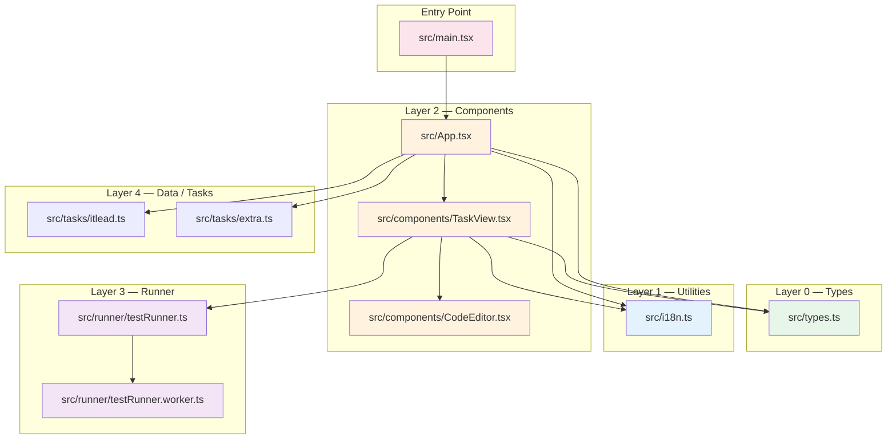
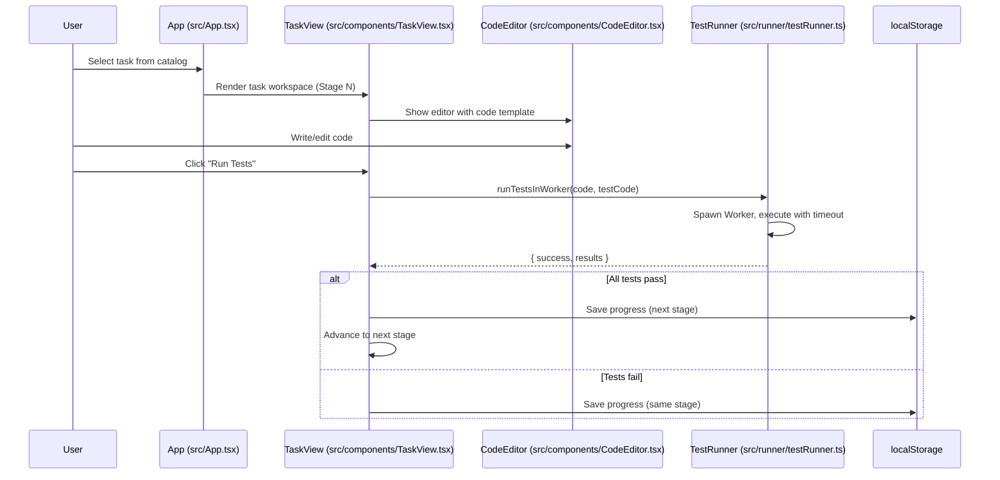

# Architecture

> Last regenerated: 2026-07-06
> Source analysis: [`src/App.tsx`](), [`src/main.tsx`](), [`package.json`]()

## 1 Overview

A single-page application for spaced-repetition code memorization. Runs entirely in the browser with no server backend. Data persists in `localStorage`. The application follows a layered architecture: **Types → Components → Runner → App**.

## 2 System Architecture

### 2.1 Module Dependency Graph



> Sources: [`src/App.tsx`](), [`src/components/TaskView.tsx`](), [`src/runner/testRunner.ts`]()

### 2.2 Layer Hierarchy

| Layer | Packages | Role | Can Import From |
|-------|----------|------|-----------------|
| L0 | `src/types.ts` | Type definitions (DrillTask, UserProgress) | Nothing |
| L1 | `src/i18n.ts` | UI translations (uk/en) | Nothing |
| L2 | `src/components/` | React components (App, TaskView, CodeEditor) | L0, L1, L2, L4 |
| L3 | `src/runner/` | Web Worker test sandbox | L0 |
| L4 | `src/tasks/` | Task data files | L0 |
| Entry | `src/main.tsx` | ReactDOM entry point | L2 |

> Enforced by: [`scripts/lint-deps.mjs`]()

### 2.3 Forbidden Dependencies

- `src/types.ts` must not import any project file
- `src/i18n.ts` must not import any project file
- `src/runner/testRunner.worker.ts` must not import from `src/components/`
- `src/tasks/` must not import from `src/components/`, `src/runner/`, or `src/i18n.ts`

## 3 Core Components

### 3.1 App — Root Component

**Purpose**: Top-level UI state, routing (dashboard/catalog/upload/backup), task filtering, progress persistence.
**Location**: `src/App.tsx`
**Lines**: ~780

**Key State**:
- `activeTab` — current navigation tab (`dashboard`, `catalog`, `upload`, `backup`)
- `selectedTaskId` — the task currently being practiced (null = dashboard)
- `progressMap` — per-task `UserProgress` (keyed by task id)
- `customTasks` — user-created tasks from localStorage

> Sources: [`src/App.tsx:29-46`](), [`src/App.tsx:82-89`](), [`src/App.tsx:169-171`]()

### 3.2 TaskView — Learning Workspace

**Purpose**: Manages all 6 learning stages + mastery (stage 7). Contains Monaco editor, test console, and stage-specific panels.
**Location**: `src/components/TaskView.tsx`
**Lines**: ~610

**Stage Flow**:
```
Stage 1 (Study) → Stage 2 (Retype) → Stage 3 (Recall) → Stage 4 (Cloze) → Stage 5 (Scratch) → Stage 6 (Exam) → Stage 7 (Mastered)
```

> Sources: [`src/components/TaskView.tsx:61-155`]()

### 3.3 CodeEditor — Monaco Wrapper

**Purpose**: Lightweight wrapper around `@monaco-editor/react` with read-only and editable modes.
**Location**: `src/components/CodeEditor.tsx`
**Lines**: ~55

> Sources: [`src/components/CodeEditor.tsx:13-55`]()

### 3.4 Test Runner — Web Worker Sandbox

**Purpose**: Runs user code against test cases in an isolated Web Worker. Prevents infinite loops (4s timeout).
**Location**: `src/runner/testRunner.ts`
**Lines**: ~80

> Sources: [`src/runner/testRunner.ts:13-78`]()

## 4 Data Flow

### 4.1 Primary Learning Flow



> Sources: [`src/components/TaskView.tsx:127-154`]()

### 4.2 Progress Flow

```
User action → onSaveProgress() → setProgressMap() → useEffect → localStorage.setItem('drill_progress_map')
```
> Sources: [`src/App.tsx:87-89`](), [`src/components/TaskView.tsx:115-121`]()

## 5 Critical Files

| File | Lines | Purpose | Key Exports |
|------|-------|---------|-------------|
| `src/main.tsx` | ~11 | Entry point | `createRoot(App)` |
| `src/App.tsx` | ~780 | Root component | `App`, `UserProgress` state, dashboard views |
| `src/components/TaskView.tsx` | ~610 | Learning workspace | `TaskView` |
| `src/components/CodeEditor.tsx` | ~55 | Monaco wrapper | `CodeEditor` |
| `src/runner/testRunner.ts` | ~80 | Test sandbox | `runTestsInWorker()` |
| `src/i18n.ts` | ~330 | Translations | `getT()`, `Lang`, `Translations` |
| `src/types.ts` | ~30 | Type definitions | `DrillTask`, `UserProgress` |
| `src/tasks/itlead.ts` | ~large | Task bank (~540 tasks) | `itleadTasks` |

## 6 Key Design Decisions

| # | Decision | Rationale |
|---|----------|-----------|
| 1 | **localStorage persistence** | No server needed; fully client-side app |
| 2 | **Web Worker test sandbox** | Isolates user code from main thread; 4s timeout prevents hangs |
| 3 | **6 learning stages** | Spaced repetition with increasing difficulty (study → retype → recall → cloze → scratch → exam) |
| 4 | **Ukrainian/English i18n** | Dual-language UI via `i18n.ts` dictionary |
| 5 | **Monaco editor** | Industry-standard code editor with syntax highlighting, autocomplete |

## 7 Dependencies

```json
{
  "dependencies": {
    "@monaco-editor/react": "^4.7.0",
    "@tailwindcss/vite": "^4.1.14",
    "react": "^19.0.1",
    "vite": "^6.2.3",
    "motion": "^12.23.24",
    "lucide-react": "^0.546.0"
  },
  "devDependencies": {
    "typescript": "~5.8.2",
    "vitest": "^4.1.9",
    "tsx": "^4.21.0"
  }
}
```

> Sources: [`package.json`]()

## See Also

- [Development Setup](docs/DEVELOPMENT.md)
- [ECL Operating Manual](docs/ECL.md)
- [Project Status](docs/STATUS.md)
