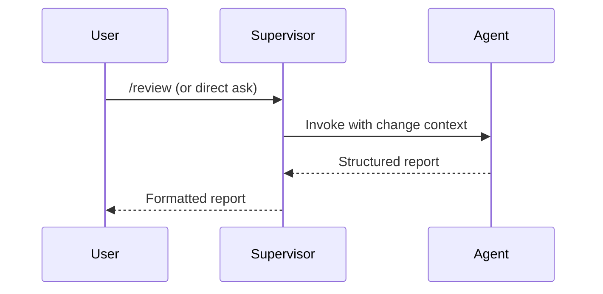
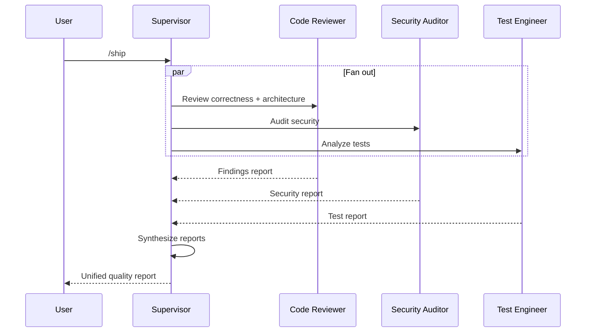

# Agents — Multi-Agent System Architecture

> Last updated: 2026-07-06

## 1 Overview

This project uses a **Supervisor + Pipeline** hybrid architecture for code review and quality assurance. The supervisor (the Claude instance running the session) orchestrates specialist agents, collects their independent findings, and synthesizes a unified result.

```
         ┌──────────────────────────────────┐
         │         Supervisor               │
         │    (Claude session orchestrator)  │
         │  Enters via slash command or task  │
         └──┬──────┬──────┬──────┬──────────┘
            │      │      │      │
      ┌─────▼┐ ┌──▼──┐ ┌─▼────┐ ┌▼────────┐
      │Code  │ │Sec  │ │Test  │ │Web Perf │
      │Review│ │Audit│ │Eng   │ │Auditor  │
      │er    │ │or   │ │ineer │ │         │
      └──────┘ └─────┘ └──────┘ └─────────┘
            │      │      │      │
         ┌──┴──────┴──────┴──────┴─────────┐
         │      Synthesized Report          │
         │  (supervisor merges findings)     │
         └──────────────────────────────────┘
```

## 2 Architecture Pattern

| Characteristic | Value |
|----------------|-------|
| **Pattern** | Supervisor + Pipeline (hybrid) |
| **Orchestration** | Slash commands (`/ship`, `/review`, `/test`, `/webperf`) |
| **Agent Communication** | None — each agent operates independently |
| **Synthesis** | Supervisor collects and merges all agent outputs |
| **Invocation Modes** | Single-agent (direct) or parallel fan-out (`/ship`) |

### Why Not Pure Swarm?

A pure swarm implies agents communicate peer-to-peer, negotiate consensus, and coordinate autonomously. This system deliberately avoids that:

- **Clarity**: each agent has a single perspective; mixing perspectives causes cognitive load
- **Reliability**: no agent depends on another agent's output — one failing agent doesn't block others
- **Simplicity**: the supervisor merges results, which is simpler than distributed consensus
- **Security**: no agent-to-agent delegation prevents privilege escalation or prompt injection via inter-agent messages

## 3 Agent Roles

| Agent | File | Focus Areas | Invoked Via |
|-------|------|-------------|-------------|
| Code Reviewer | `.claude/agents/code-reviewer.md` | Correctness, readability, architecture, security, performance | `/review` (solo), `/ship` (fan-out) |
| Security Auditor | `.claude/agents/security-auditor.md` | Vulnerability detection, threat modeling, secure coding | `/ship` (fan-out), standalone request |
| Test Engineer | `.claude/agents/test-engineer.md` | Test strategy, test writing, coverage analysis | `/test`, `/ship` (fan-out) |
| Web Performance Auditor | `.claude/agents/web-performance-auditor.md` | Core Web Vitals, loading optimization, rendering | `/webperf`, standalone request |

## 4 Orchestration Flow

### 4.1 Single-Agent Mode

Used when the user wants a focused review from one perspective.



### 4.2 Parallel Fan-Out Mode (`/ship`)

Used for pre-merge quality gates. Runs all agents simultaneously, then merges results.



### 4.3 Pipeline Mode (future)

If a finding from one agent logically requires a deeper follow-up (e.g., code-reviewer flags a performance issue → supervisor may invoke web-performance-auditor as a second pass), this is a pipeline extension initiated by the supervisor, not by an agent.

## 5 Communication Rules

### Hard Rules (enforced by agent .md files)

1. **No agent calls another agent.** Each agent's `Composition` section explicitly forbids invoking another agent. This is not negotiable.
2. **No agent delegates work.** If an agent encounters something outside its scope, it includes a recommendation in its report for the supervisor to act on.
3. **No agent modifies another agent's output.** Each agent writes its own report section; the supervisor merges them.

### Soft Rules (best practices)

4. **Findings are tagged by severity** (Critical / High / Medium / Low) so the supervisor can prioritize.
5. **Each agent must include positive observations** — not just problems.
6. **Reports must be mergeable** — use consistent format so the supervisor can concatenate without conflict.

## 6 Context Loading Order

When an agent is invoked:

1. Read `AGENTS.md` for project overview
2. Read `docs/AGENTS.md` (this file) for multi-agent architecture
3. Read the agent's own `.md` file for its persona prompt
4. Read the specific change or file being reviewed
5. For `/ship`: all agents read the same change context independently
6. The supervisor reads all agent outputs, then synthesizes

## 7 Safety Boundaries

- Agents operate within their defined scope only
- If an agent detects a cross-cutting concern (e.g., code-reviewer finds a security issue), it flags it in its report — it does not pivot or change persona
- The supervisor decides whether extra scrutiny is needed from another agent
- No agent has permission to execute destructive operations (deploy, delete, modify CI config) unless explicitly authorized by the user's current task

## 8 Slash Command Reference

| Command | File | Mode | Agents Invoked |
|---------|------|------|----------------|
| `/review` | `.claude/commands/review.md` | Single | Code Reviewer |
| `/ship` | `.claude/commands/ship.md` | Fan-out | Code Reviewer, Security Auditor, Test Engineer |
| `/test` | `.claude/commands/test.md` | Single / TDD | Test Engineer |
| `/webperf` | `.claude/commands/webperf.md` | Single | Web Performance Auditor |

## 9 Change Management

Multi-agent reviews should be tracked as ECL changes (see `docs/ECL.md`):

```bash
node scripts/harness-change.mjs new "review: feature-X pre-merge"
```

This creates `harness/changes/active/` with spec, plan, and tasks for the review. After the review is complete and findings are addressed:

```bash
node scripts/harness-change.mjs close completed
```

## See Also

- [Architecture Overview](docs/ARCHITECTURE.md) — Application architecture
- [ECL Operating Manual](docs/ECL.md) — Change lifecycle
- [Project Status](docs/STATUS.md) — Current handoff state
