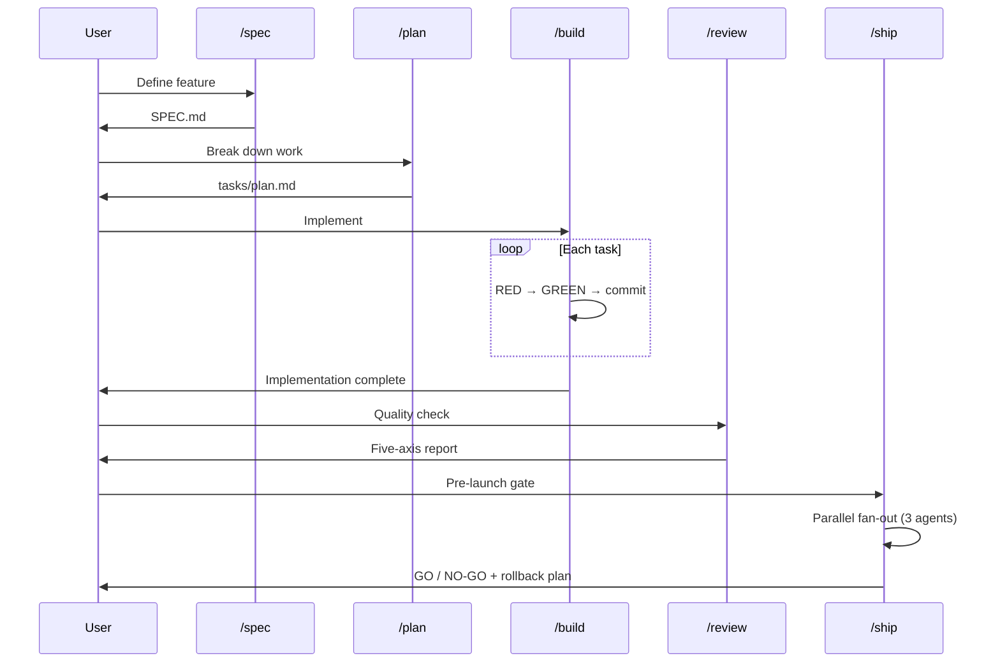
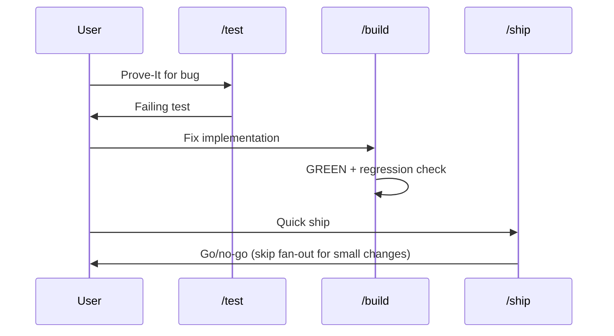
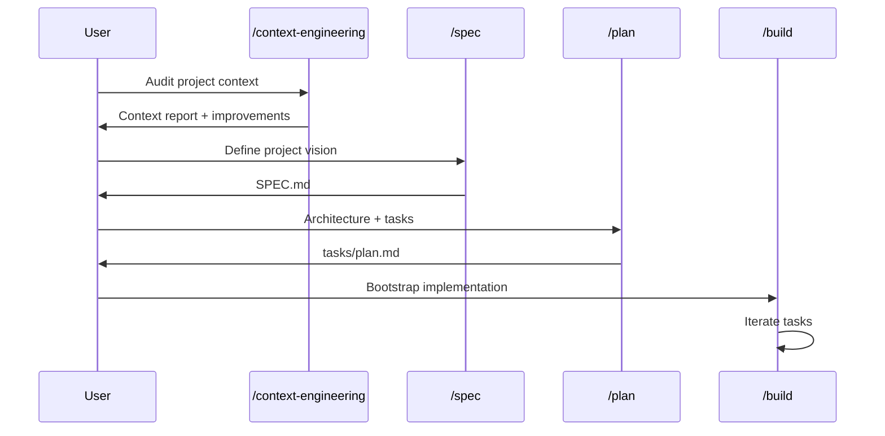

# Commands — Slash Command Architecture

> Last updated: 2026-07-06

## 1 Overview

This project has **9 slash commands** that form a complete development lifecycle: from specification through planning, implementation, testing, review, and shipping. They follow a **Pipeline + Fan-out** pattern — sequential phases with parallel fan-out at the review stage.

```
                    ┌─────────────────┐
                    │  /context-eng   │  ← project setup (orthogonal)
                    └─────────────────┘

                     ┌──────────────┐
                     │    /spec     │  ← WHAT to build
                     └──────┬───────┘
                            │
                     ┌──────▼───────┐
                     │    /plan     │  ← HOW to build it
                     └──────┬───────┘
                            │
              ┌──────┬──────▼──────┬──────┐
              │      │             │      │
         ┌────▼──┐ ┌▼────────┐ ┌──▼───┐ ┌▼─────────┐
         │/build │ │/test    │ │/code-│ │/webperf  │
         │       │ │(TDD)    │ │simpl.│ │(audit)   │
         └──┬────┘ └─────────┘ └──────┘ └──────────┘
            │
     ┌──────▼──────┐
     │   /review   │  ← single-perspective review
     └──────┬──────┘
            │
     ┌──────▼──────┐
     │   /ship     │  ← multi-perspective fan-out
     └─────────────┘        + go/no-go decision
```

## 2 Command Dependency Graph

```mermaid
graph LR
    subgraph "Planning Phase"
        SPEC[/spec] --> PLAN[/plan]
    end
    subgraph "Implementation Phase"
        PLAN --> BUILD[/build]
        PLAN --> TEST[/test]
        TEST --> BUILD
        BUILD --> SIMPLIFY[/code-simplify]
    end
    subgraph "Quality Phase"
        BUILD --> REVIEW[/review]
        BUILD --> WEBPERF[/webperf]
    end
    subgraph "Launch Phase"
        REVIEW --> SHIP[/ship]
        WEBPERF --> SHIP
    end
    subgraph "Setup (orthogonal)"
        CE[/context-engineering]
    end

    style SPEC fill:#e3f2fd,stroke:#1565c0
    style PLAN fill:#e8f5e9,stroke:#2e7d32
    style BUILD fill:#fff3e0,stroke:#e65100
    style TEST fill:#f3e5f5,stroke:#6a1b9a
    style SIMPLIFY fill:#fce4ec,stroke:#c62828
    style REVIEW fill:#fff8e1,stroke:#f57f17
    style WEBPERF fill:#e0f2f1,stroke:#00695c
    style SHIP fill:#fbe9e7,stroke:#bf360c
    style CE fill:#efebe9,stroke:#4e342e
```

## 3 Command Classification

| Phase | Command | Type | Description | Dependencies |
|-------|---------|------|-------------|--------------|
| **Setup** | `/context-engineering` | Diagnostic | Audit CLAUDE.md, project health, context setup | None |
| **Spec** | `/spec` | Generative | Write structured specification (SPEC.md) | None |
| **Plan** | `/plan` | Generative | Break spec into tasks (tasks/plan.md, tasks/todo.md) | `/spec` |
| **Implement** | `/build` | Generative | Implement tasks incrementally (RED→GREEN→commit) | `/plan` |
| **Implement** | `/test` | Generative | TDD workflow, Prove-It for bugs | `/plan` |
| **Implement** | `/code-simplify` | Refactoring | Reduce complexity, improve readability | `/build` |
| **Review** | `/review` | Diagnostic | Five-axis code review | `/build` |
| **Review** | `/webperf` | Diagnostic | Web performance audit | `/build` |
| **Launch** | `/ship` | Diagnostic + Decision | Parallel fan-out + go/no-go + rollback plan | `/review`, `/build` |

### 3.1 Generative vs Diagnostic

- **Generative** — produces new code, files, or artifacts (spec, plan, implementation, tests)
- **Diagnostic** — analyzes existing code/files and produces reports (review, audit, context check)
- **Refactoring** — modifies existing code without changing behavior (code-simplify)
- **Decision** — synthesizes multiple inputs into a go/no-go verdict (ship)

## 4 Pipeline Flow

### 4.1 Standard Development Flow



### 4.2 Quick Bug Fix Flow



### 4.3 New Project Setup Flow



## 5 Agent Invocation Map

| Command | Agent(s) Invoked | Invocation Mode | Notes |
|---------|-----------------|-----------------|-------|
| `/spec` | None (uses skill) | Sequential | Skill-based, no subagent |
| `/plan` | None (uses skill) | Sequential | Skill-based, no subagent |
| `/build` | None (uses skill) | Sequential | Skill-based; `/build auto` loops autonomously |
| `/test` | None (uses skill) | Sequential | TDD via skill |
| `/code-simplify` | None (uses skill) | Sequential | Skill-based |
| `/review` | `code-reviewer` | Single agent | Five-axis review |
| `/webperf` | `web-performance-auditor` | Single agent | Quick or Deep mode |
| `/context-engineering` | None (uses skill) | Sequential | Skill-based |
| `/ship` | `code-reviewer`, `security-auditor`, `test-engineer` | **Parallel fan-out** | 3 subagents concurrently |

### 5.1 Single-Agent Commands

`/review` and `/webperf` invoke exactly one specialist agent. The command acts as a thin wrapper:

```
Command → spawn agent → receive report → format → user
```

These do NOT require synthesis — the agent's output is the final output.

### 5.2 Fan-Out Command (`/ship`)

`/ship` is the only command that spawns multiple agents. It follows a 3-phase protocol:

```
Phase A (parallel):  spawn code-reviewer, security-auditor, test-engineer
Phase B (merge):     supervisor deduplicates and prioritizes findings
Phase C (decision):  GO/NO-GO verdict + rollback plan
```

The fan-out only runs for non-trivial changes (>2 files, >50 lines, or touching auth/payments/data/config). Small changes skip the fan-out entirely.

## 6 Command States

Each command can be in one of these states:

```
spec.md → ideal flow
↓
REJECTED → user rejects spec → revise or abandon
APPROVED → proceed to /plan
↓
tasks/plan.md
↓
PENDING  → planned but not started
IN_FLIGHT → being implemented
BLOCKED  → waiting on dependency/decision
COMPLETED → done
↓
/review → findings
↓
/ship → GO or NO-GO
         ↓                   ↓
      DEPLOYED           RETURNED    (for fixes)
```

## 7 Command File Structure

Each command is a `.md` file in `.claude/commands/` with:

```yaml
---
description: <one-line summary shown in autocomplete>
---

<body with instructions for the agent>
```

| File | Lines | Purpose |
|------|-------|---------|
| `.claude/commands/spec.md` | ~15 | Spec-driven dev entry |
| `.claude/commands/plan.md` | ~12 | Task breakdown |
| `.claude/commands/build.md` | ~55 | Incremental implementation, auto mode |
| `.claude/commands/test.md` | ~12 | TDD, Prove-It pattern |
| `.claude/commands/code-simplify.md` | ~10 | Code simplification |
| `.claude/commands/review.md` | ~10 | Five-axis review |
| `.claude/commands/webperf.md` | ~30 | Performance audit |
| `.claude/commands/ship.md` | ~80 | Fan-out + decision |
| `.claude/commands/context-engineering.md` | ~10 | Context audit |

## 8 Invocation Rules

1. **Commands are sequential by default** — only `/ship` uses parallel fan-out
2. **Commands respect the pipeline order** — don't run `/review` without code, don't run `/plan` without a spec
3. **Commands do NOT call each other** — each command is a self-contained entry point
4. **Commands delegate to skills** — most commands invoke a skill (e.g., `agent-skills:incremental-implementation`) rather than directly containing logic
5. **`/ship` is the only multi-agent command** — because production launch requires cross-perspective verification

## 9 Relation to Agents

```
Commands ────orchestrate───► Agents (specialist reviewers)
                              ├── code-reviewer
    │                        ├── security-auditor
    │                        ├── test-engineer
    │                        └── web-performance-auditor
    │
    └──────────delegate to──► Skills (implementation logic)
```

- **Commands**: user-facing entry points (what the user types)
- **Agents**: review/audit personas (invoked by `/review`, `/webperf`, `/ship`)
- **Skills**: reusable implementation units (invoked by commands via `Invoke the ... skill`)

## 10 Extending Commands

To add a new command, create a `.md` file in `.claude/commands/`:

```yaml
---
description: <one-line description for autocomplete>
---

<body with step-by-step instructions>
```

The file is auto-discovered by Claude Code for `/` autocomplete. Follow these conventions:

- Front matter with `description` only (no additional metadata required)
- Body is procedural: what to do, in what order, with what outputs
- Reference skills and agents by their canonical names
- Keep it focused — one command = one job

## See Also

- [Agent Architecture](docs/agents.md) — Multi-agent system design
- [Architecture Overview](docs/ARCHITECTURE.md) — Application architecture
- [ECL Operating Manual](docs/ECL.md) — Change lifecycle
